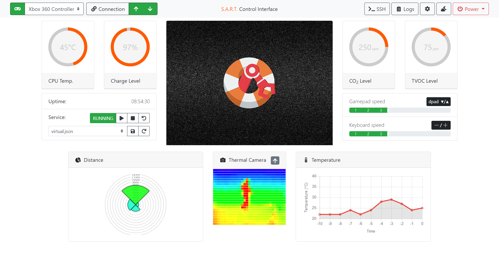

# SART Integrated GUI and Host Teleoperation Service (SIGHTS) Interface

## About

The SIGHTS Interface is the complete browser-based control interface used to control SIGHTS-compatible robots.
Features include:

- Up to four video camera streams through [Motion](https://github.com/Motion-Project/motion)
- Integrated tabbed SSH console allowing advanced access to the underlying OS
- Full gamepad and keyboard support
- Full visual configuration file editor and an advanced text-based editor
- Configuration file management allowing you to swap the active configuration file at runtime, even if the SIGHTSRobot service is stopped or has crashed
- Keep track of old revisions of your config file to easily restore to a previous version
- Light and dark themes
- Ability for the operator to safely shut down or restart the robot through the interface

Users never have to access the robot's hardware directly – everything can be done within the interface.

## Installation

For installation, please refer to [the SIGHTSRobot repository](https://github.com/SFXRescue/SIGHTSRobot) which provides a detailed installation guide to the entire SIGHTS software package.

## Demo

A live demo is available [here](https://www.sfxrescue.com/interfacedemo).

## Contributing

If you have an idea, suggestion or bug report for **SIGHTSInterface**, or want to make a contribution of your own, we'd love to work with you to make it happen! Take a look at our [contributing page](https://github.com/SFXRescue/.github/blob/master/CONTRIBUTING.md) for more information.
